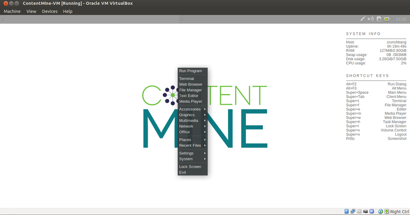
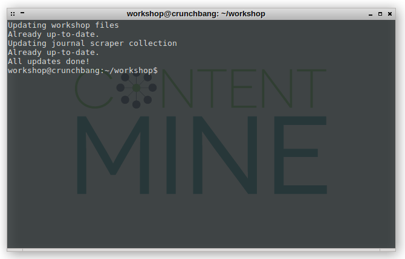
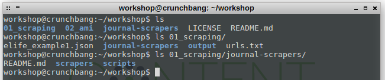
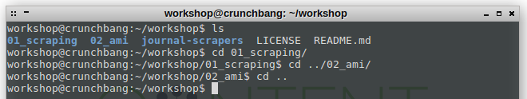

.png)


# Working in the ContentMine virtual machine

[Usage](# 1. Usage)

[Commands](# 2. Basic Commands)

After installing the vm ([see here](installation_instructions.md)), you can start the machine from the VirtualBox interface. Choose the image called ContentMine-VM and click the "Start" button.


After a few seconds you land on the desktop.



## 1. Usage

Everything starts with a right click from here. If you want navigate through the folders on the machine, right-click on the desktop and select "File Manager". There is also a browser included, which can be opened with right-click and "Web Browser".
The ContentMine pipeline is controlled from the command line interface, which can be opened with right-click and "Terminal". This opens a text-based interface, from where we can navigate folders, look into files, and interact with the ContentMine software.



You can maximize it to fullscreen by double clicking on the title bar.

**Troubleshooting**

If you run into issues with your keyboard layout, open a terminal window and enter your locale, e.g. uk/us/de
```
setxkmap us
```

If you can't access your USB-device from inside the vm while running Ubuntu as a host system, try [this solution](http://askubuntu.com/questions/140081/virtualbox-doesnt-recognize-usb). 


## 2. Basic commands

In general: autocompletion with 'tab' may save you a lot of typing.

ls: **l**i**s**ts files and directories, takes the current working directory as root. You can also look into the content of nested directories by simply extending the path.



cd: **c**hange **d**irectory, moves the working directory location to the target location. You can move laterally between folders on the same level with ```cd ../new_location```. You can also move up in the directory hierarchy with ```cd ..```. If you want to navigate to an absolute path, you have to start with a slash "/", ```cd /home/workshop/workshop/absolute_path```.



mv: **m**o**v**es files and directories from the first location to the second, e.g. files from a USB-stick to the working directory. If you plug in a USB-stick, it will show up in /


mkdir: **m**a**k**e **dir**ectory: creates a new directory

cp: **c**o**p**ies files from the first location to the second

rm: **r**e**m**oves the specified file. If you want to remove a directory, use rm -r but make sure you want this.
